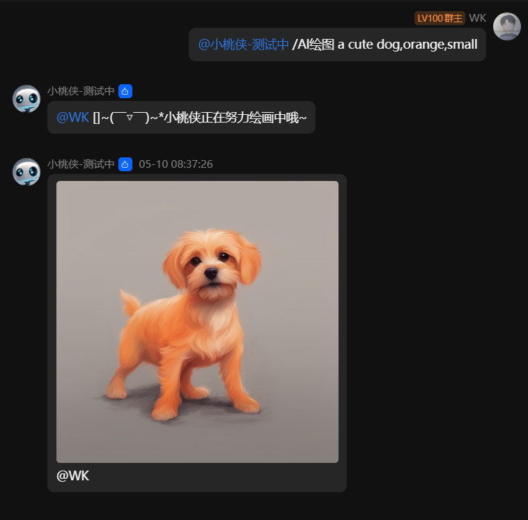
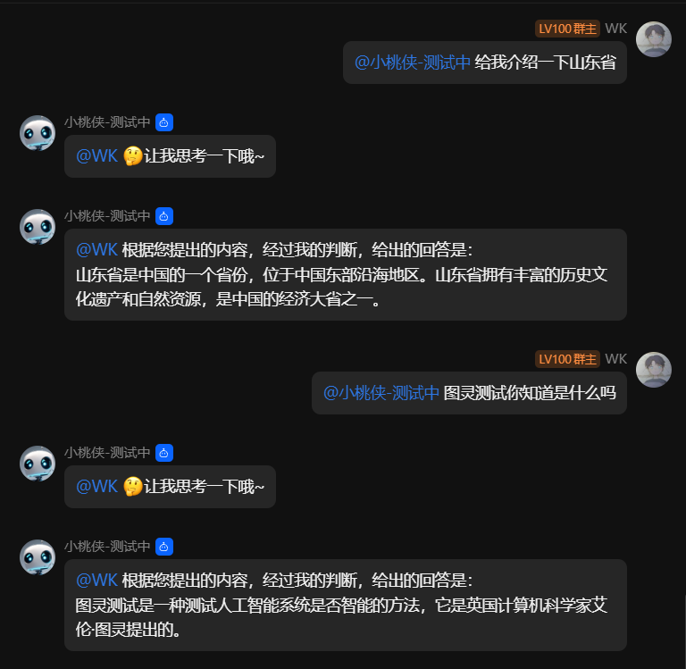
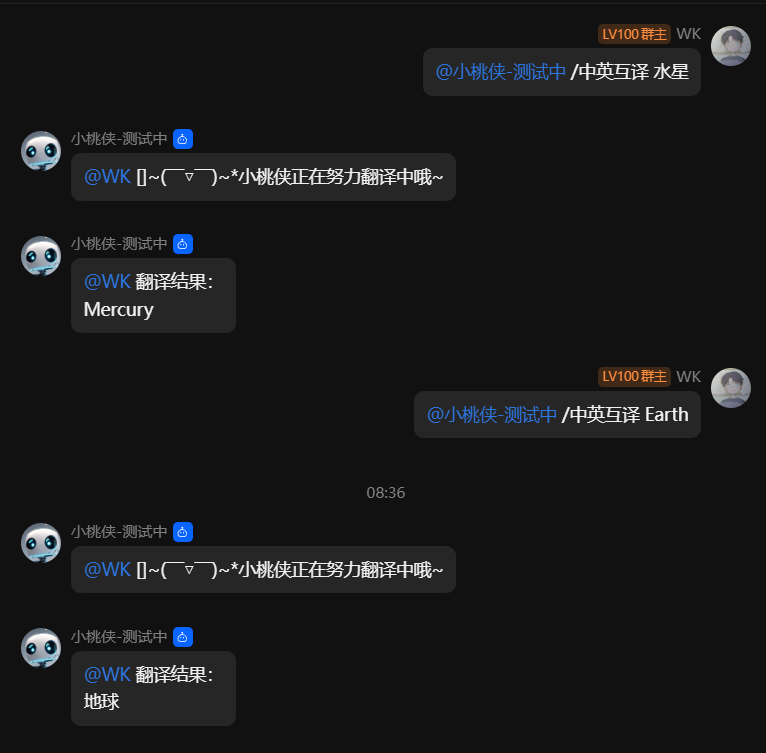
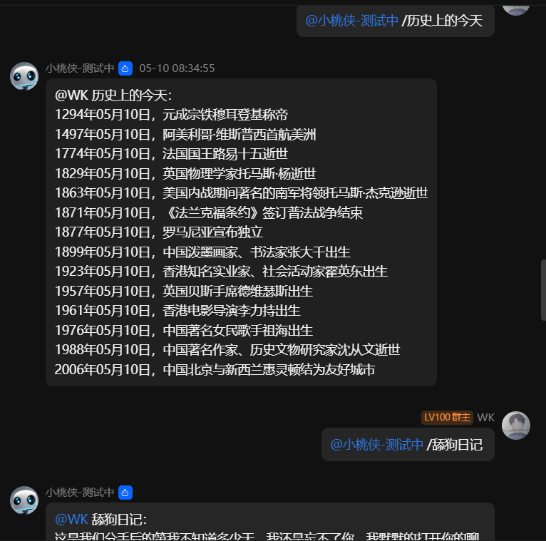

</img>
<div style="text-align: center;font-size: 14px;font-weight: bold;">QQ-Bot</div>

# QQ-Bot
一个用于自动化QQ消息和群组管理的机器人。

## 简介
QQ-Bot是一个开源项目，旨在通过自动化的方式简化QQ的日常使用和管理。它支持在线AI绘图、AI智能对话、实时翻译、调用API等功能。

## 功能
- **在线AI绘图**：根据用户输入的提示词，在线AI绘图，生成图片并发送给用户。
- **AI智能对话**：通过AI智能对话，与机器人进行聊天。
- **实时翻译**：实时翻译用户发送的消息。
- **调用API实例**：通过调用API，获取AI绘图、AI智能对话、实时翻译等结果。

## 安装
1. 克隆仓库：`git clone https://github.com/Lonely-bear/qq-bot`
2. 安装依赖：`npm install`
3. 启动机器人：`npm start`

## 截图
<div style="text-align: center;font-size: 14px;font-weight: bold;">在线AI绘图</div>



<div style="text-align: center;font-size: 14px;font-weight: bold;">AI智能对话</div>



<div style="text-align: center;font-size: 14px;font-weight: bold;">实时翻译</div>



<div style="text-align: center;font-size: 14px;font-weight: bold;">调用API实例</div>


## 如何贡献
如果你想为QQ-Bot贡献代码，请提交PR。

## 许可证
本项目使用[MIT许可证](LICENSE)。

## 联系方式
- QQ群1: 677987033  (未满)
- QQ群2: 729571768	(未满)

## 项目配置
##### 填写机器人配置，在main.js文件中，填入自己的机器人ID和密钥
main.js
```javascript
const botConfig = {
	appid: 'xxx', // qq机器人的appID (必填)
	secret: 'xxx', // qq机器人的secret (必填)
	sandbox: true, // 是否是沙箱环境 默认 false
	removeAt: true, // 移除第一个at 默认 false
	logLevel: 'info', // 日志等级 默认 info
	maxRetry: 10, // 最大重连次数 默认 10
	intents: [
		'GROUP_AT_MESSAGE_CREATE', // 群聊@消息事件 没有群权限请注释
		// 'C2C_MESSAGE_CREATE', // 私聊事件 没有私聊权限请注释
		// 'GUILD_MESSAGES', // 私域机器人频道消息事件 公域机器人请注释
		'PUBLIC_GUILD_MESSAGES', // 公域机器人频道消息事件 私域机器人请注释
		'DIRECT_MESSAGE', // 频道私信事件
		'GUILD_MESSAGE_REACTIONS', // 频道消息表态事件
		'GUILDS', // 频道变更事件
		'GUILD_MEMBERS', // 频道成员变更事件
		'DIRECT_MESSAGE', // 频道私信事件
	],
};
```

## 测试
在QQ机器人管理端的沙箱配置中，配置一个测试的群号，在群里添加该测试机器人，即可进行测试使用.

## 贡献库
* axios
* openai
* @baiducloud/qianfan
* request
* qq-group-bot: [https://github.com/lc-cn/qq-group-bot](https://github.com/lc-cn/qq-group-bot)